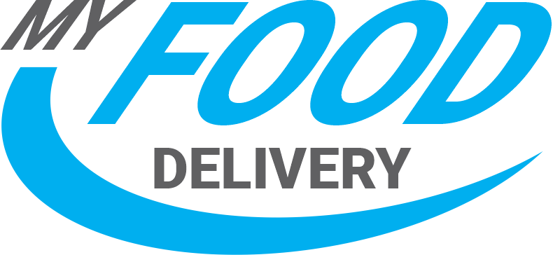
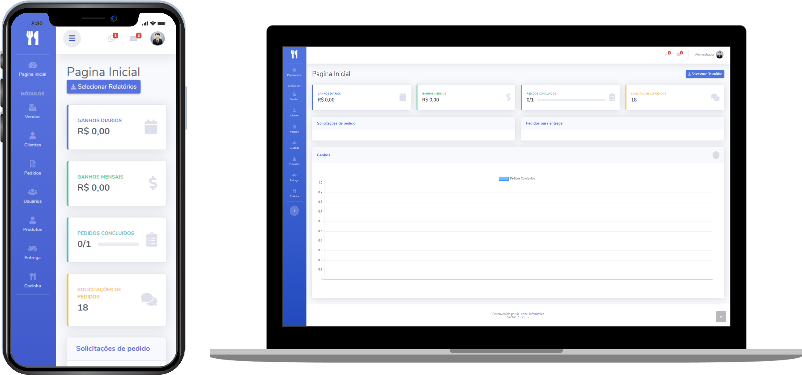

<h1 align="center">
    
</h1>

<h4 align="center">
  My Food Delivery
</h4>

Aplicação para gestão de pequenos restaurantes com foco em cozinha, entrega e mesas.

 

 

  <a href="#tecnologias">Tecnologias</a>&nbsp;&nbsp;&nbsp;|&nbsp;&nbsp;&nbsp;
  <a href="#projeto">Projeto</a>&nbsp;&nbsp;&nbsp;|&nbsp;&nbsp;&nbsp;

 

  

## Tecnologias

Esse projeto foi desenvolvido com as seguintes tecnologias:

- [Python]()
- [pyufbr]()
- [Python-Flask]()
- [Flask-Script]()
- [Flask-SQLAlchemy]()
- [Flask-WTF]()
- [Flask-Login]()
- [Flask-Uploads]()
- [Flask-Migrate]()
- [Flask-Datepicker]()
- [Flask-Bootstrap4]()
- [WTForms-SQLAlchemy]()
- [SQLITE]()

## 💻 Projeto

O My Food Delivery visa atender pequenos estabelecimentos trazendo facilidades para otimizar o tempo destes restaurantes.

### Funcionalidades já presentes

- Funiconalidade 1

### Funcionalidades que serão implementadas

- Funiconalidade 1

## Instruções de instalação

- Possuir uma instalação atualizada do python
- Criar o Virtual Environment instalando as dependencias contidas em `requirements.txt` com o comando `pip install requirements.txt -r`

### Rodar localmente

- Para executar localmente basta usar o comando `python manage.py runserver`

### Rodar localmente mas aberto para a rede

- Para iniciar o servidor em rede local `export FLASK_APP=manage.py` ou `set FLASK_APP=manage.py` no windows

- Após para rodar execute o comando `flask run --host=0.0.0.0`

---

Feito com ♥ by Filipe Batista:wave: [Veja mais no meu instagram!](https://www.instagram.com/filipegaucho22/)
